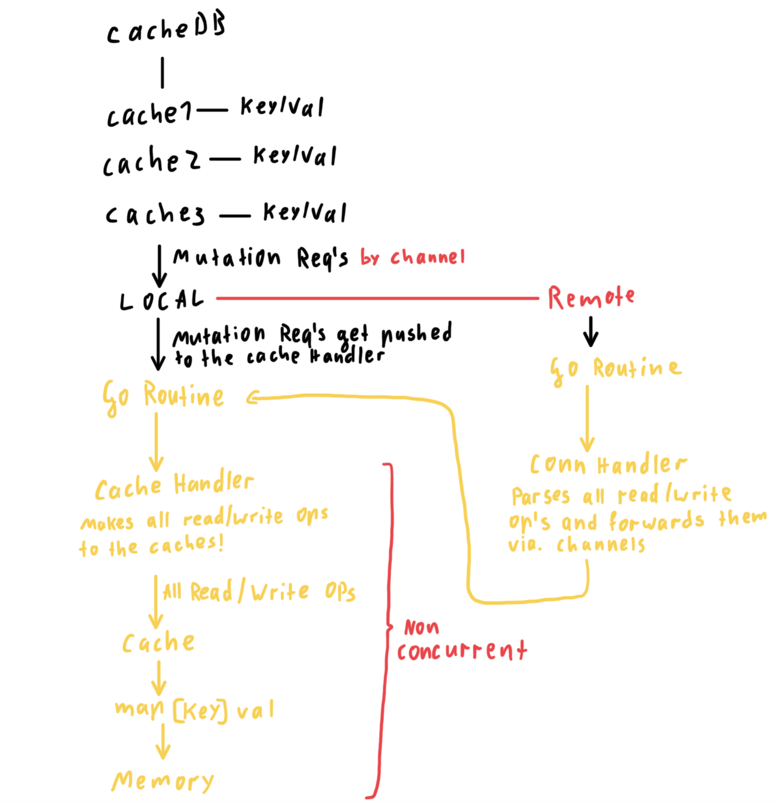

# Remote Cache To Go

This project creates a remote-database and an embedded-cache storage hybrid which enables live data synchronisation as well as encrypted and authorised data exchange.
By maintaining go's idiomatic routine/ channel **, concurrency is built into the program by design. No mutex and a package that reduces dependencies and synchronisation issues to zero.

## Layout

The cacheMap is a simple map type object which is held in cache which enables fast and temporary data storage, exchange or buffering. The remote data transmission is done via. TCP sockets with a very simple protocol to minimize conflicts, tx comm size and to keep the bare-metal like simplicity of the package.

## Example


Server:
``` go
// creating new cache database
cDb := cacheDb.New()

// creating new caches in database
cDb.NewCache("test")
cDb.NewCache("remote")

// adding new entry to cache "test" at key "testkey" with val "test1"
if cDb.AddEntryToCache("test", "testKey", []byte("test1")) {
  fmt.Println("Written val to testKey")
}

// pulling data from cache "test" at key "testKey"
fmt.Println("Requestd key: " + string(cDb.GetEntryFromCache("test", "testKey")))

// creating encrypted network interface for cache with name "remote" and the password hash "test" and enabled dosProtection
// serverCert & Key are passed hardcoded only for testing purposes
cDb.Db["remote"].RemoteTlsConnHandler(8000, "test", true, serverCert, serverKey)


// creating unencrypted network interface for cache with name "remote"
cDb.Db["remote"].RemoteConnHandler(8000)
```
Client:
``` go
// creates new cacheClient struct and connects to remoteCache instance
// no tls encryption -> param3: false
client, err := cacheClient.New("127.0.0.1", 8000, false, "", "")
if err != nil {
  fmt.Println(err)
  return
}

// creates new cacheClient struct with TLS conn
// params remote Cache IP, remote Cache port, wether connect with TLS encryption, root Cert for TLS encryption
tlsClient, err := cacheClient.New("127.0.0.1", 8000, true, "test", rootCert)

// writing to connected cache to key "remote" with val "test1"
client.AddKeyVal("remote", []byte("test1"))
```

## Network communication protocol

Protocol layout:

`{key}-{operation}-{payload}`

- key equals the key in the cache
- operation can be either push or pull
- payload is a byte array

> Disclaimer
> The protocol has not been pen tested and development has only been driven by the good intentions of the developer.
> No guarantee for data loss or potential exploitation

## Sketch of routine layout


